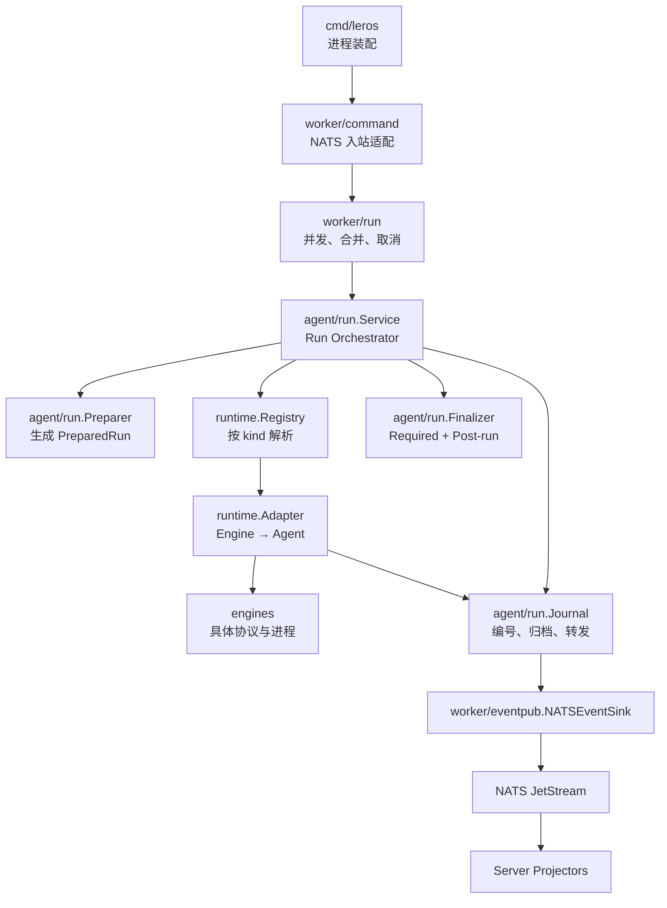
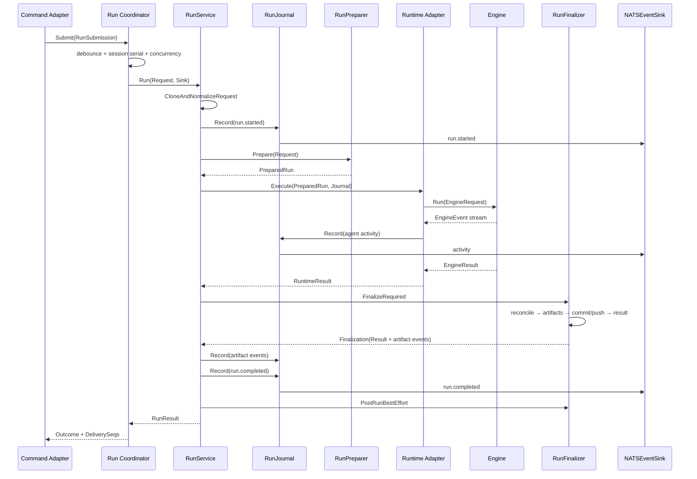

# Agent Runtime 架构最终调整方案

> 状态：最终设计方案
>
> 更新时间：2026-06-28
>
> 当前架构参考：[leros-architecture.html](./leros-architecture.html)

## 1. 最终结论

当前 Server/Worker 分离、`WorkerCommand` 统一协议、四条 command lane，以及
`run.stream` / `run.state` 双 lane 已经形成稳定的跨进程边界。本次不重新设计这些部分。

调整范围限定在 Worker 内部的 Agent Run：

```text
NATS Command
    → Command Adapter
    → Run Coordinator
    → Agent RunService
    → RunPreparer
    → PreparedRun
    → Runtime Registry
    → Runtime Adapter
    → Engine
    → RunFinalizer
```

事件链路：

```text
EngineEvent
    → Runtime Adapter
    → agent.Event
    → RunJournal
    → NATSEventSink
    → NATS run.stream / run.state
    → Server Projector
```

最终设计采用以下关键决策：

1. 原始 `agent.Request` 与准备后的 `agent.PreparedRun` 完全分离。
2. RunService 是流程 Orchestrator，不直接实现所有准备和收尾逻辑。
3. 上层只保留一个 `agent.EventSink` 接口；不再定义重复的 EventPublisher 接口。
4. RunJournal 只编号、记录、聚合和转发，不判断 Run 终态。
5. Required Finalize 与 best-effort post-run 明确分开。
6. RunCoordinator 只管理 Worker 本地调度，不理解 Workspace、Model、Engine 或 Event 类型。
7. Runtime Registry 与 Runtime Adapter 分离。
8. Engine 只能输出 `EngineEvent` 和 `EngineResult`，不能引用 Agent、Messaging 或 Session 领域类型。

## 2. 当前代码证据

### 2.1 Request 当前确实被当作可变状态

当前 lifecycle pipeline 中：

- `NormalizeStep` 调用 `NormalizeRequest(state.OriginalRequest)`，直接修改原始请求。
- `ModelStep` 将原始模型配置写入 model router 后，再修改 `req.Model.BaseURL`。
- `ContextStep` 之后才通过 `ContextBuilder.Prepare` 克隆请求并写入 System Prompt。
- Handler 在 lifecycle 前直接修改 `req.Runtime.WorkDir` 和 `req.Workspace.RepoDir`。
- `JournalStep` 和 `ContextStep` 会修改 `Request.EventSink`。

因此当前 `RequestContext` 同时表达：

- Server 传入的原始意图。
- Worker 补充的 Workspace 状态。
- Prepare 后的模型和 Prompt。
- 事件输出通道。

这正是调用链难以追踪的重要原因。

### 2.2 RunService 不能只是替代旧 lifecycle.Runner

当前 pipeline 包含十余个 Step。简单将它们搬进新的 RunService，只会把复杂度从
Handler/lifecycle 包移动到一个新的大型类型。

RunService 应只持有四个依赖：

```go
type Service struct {
    preparer        RunPreparer
    runtimeResolver RuntimeResolver
    finalizer       RunFinalizer
    journalFactory  JournalFactory
}
```

其职责仅是控制顺序、错误分类和终端事件。

### 2.3 Engine 当前穿透了 Runtime 边界

当前 `engines.Engine` 直接使用 `internal/runtime/events.Event`，native Engine 也直接产生：

- `run.started`
- `message.result`
- `run.completed`
- `run.failed`

随后 `externalcli.Runner` 再过滤这些事件并组装 `agent.RunResult`。这使 Engine 与
Agent lifecycle 使用同一事件语言，Runtime Adapter 很容易被绕过。

此外 native Engine 当前根据 `SessionID` 自行加载 Session 历史；该职责应属于
Preparer，Engine 只应接收准备完成的 messages。

最终设计将 Engine 事件与 Agent 事件拆开。

### 2.4 Session complete 属于 Server projector

Worker 使用的 `PassthroughSessionMessageProvider.CompleteClaimed` 是 no-op。真正的 Session
消息完成、失败、取消和 artifact 持久化由 Server 的 state projector 处理。

因此目标架构中删除 Worker 侧 `SessionCompleteStep`。Worker 只发布 terminal event，
不表达“数据库 Session 已完成”。

### 2.5 Learning 已是 best effort，但执行顺序不正确

当前 `LearningStep` 会吞掉错误，不改变主 Run 状态，这是正确语义；但它位于 terminal
event 之前。目标顺序调整为：

```text
Required Finalize
→ Emit Terminal
→ Post-run Best Effort
```

Learning、metrics 和 diagnostics 无论成功失败，都不能修改已经确定的 RunResult。

## 3. 设计尺度

### 3.1 保留

- Server / Worker 两进程模型。
- `pkg/messaging` wire contract。
- 四条 Worker command lane。
- `run.stream` / `run.state` 双 lane。
- JetStream sequence tracking。
- Session 级 debounce。
- Provider session resume。
- InteractionRouter 审批/提问机制。
- Server state/stream projectors。

### 3.2 不做

- 不增加服务进程、NATS stream 或 lane。
- 不引入工作流引擎、事件溯源框架或持久化状态机。
- 不重做 Worker Scheduler、WebSocket 管理或 Skill 系统。
- 不把每个 Prepare/Finalize 步骤做成独立 package 或 Step 对象。
- 不让 `pkg/messaging` 依赖 `internal/agent`。
- 不让 RunService、Runtime 或 Engine 访问 NATS。

### 3.3 参考项目取舍

- **Pi**：吸收 Agent 对运行状态和标准事件流的清晰所有权；不要求外部完整 Agent CLI
  进入统一的模型工具循环。
- **Multica**：吸收执行过程 Events 与最终 Result 分离，以及 CLI Backend 只处理自身
  协议的边界；不复制大型 Daemon 对象。
- **Hermes Agent**：吸收 Provider transport 只负责格式转换和响应标准化的窄接口；
  不复制大型 conversation loop 或全局运行时状态。

## 4. 目标分层与依赖方向



依赖约束：

```text
cmd
  → worker adapters
  → worker/run
  → agent/run
  → agent ports

runtime implementation
  → agent ports
  → engines

engines
  → 不依赖 agent/runtime/messaging/NATS
```

`Runtime` 与 `RuntimeResolver` 端口定义在 `internal/agent`，由 `internal/runtime`
实现。这样 Agent RunService 不需要 import Runtime 实现包，避免 Go import cycle。

## 5. 核心数据模型

### 5.1 Request：原始不可变输入

`agent.Request` 表达调用方意图：

- Run/Trace/Task 标识。
- Assistant 与 Actor 快照。
- Conversation 和原始输入。
- 请求的 Project/Workspace 标识。
- 请求的 Runtime kind。
- 原始 Model 配置。
- Capability 与 Policy。

Request 不包含：

- 最终 WorkDir、RepoDir、TaskDir。
- 构建后的 System Prompt。
- 解析后的 tools/skills。
- Artifact baseline。
- EventSink。
- NATS route、subject 或 delivery sequence。

Go 无法对普通 struct 强制不可变，因此采用以下约束：

- Command Mapper 创建 Request 后不再修改。
- RunService 入口先执行 deep clone 和最小规范化。
- Preparer 只读 normalized Request。
- PreparedRun 拥有独立的 slice/map 副本。
- 使用测试对比 Run 前后的 Request，防止回归。

### 5.2 PreparedRun：准备完成的执行上下文

```go
type PreparedRun struct {
    // Request is the normalized immutable input retained for audit/finalization.
    Request *Request

    RuntimeKind string
    Spec        ExecutionSpec
    Workspace   PreparedWorkspace
    Baseline    ArtifactBaseline
}

type ExecutionSpec struct {
    SystemPrompt   string
    Prompt         string
    Messages       []InputMessage
    Model          PreparedModel
    AllowedTools   []string
    PermissionMode string
    MaxSteps       int
}

type PreparedWorkspace struct {
    WorkDir string
    RepoDir string
    TaskDir string
}

type ArtifactBaseline struct {
    Ref string
}
```

约束：

- Runtime 只消费 `PreparedRun.Spec` 与 `PreparedRun.Workspace`。
- Runtime 不回写 PreparedRun。
- `PreparedRun.Request` 只用于关联、审计、finalize 和 post-run。
- Baseline 可以引用磁盘快照，不要求把完整文件树加载到内存。

### 5.3 RuntimeResult：执行结果，不是 Run 终态

```go
type RuntimeResult struct {
    Message                string
    Usage                  *Usage
    ToolCalls              []ToolCallRecord
    ProviderConversationID string
    Metadata               map[string]string
}
```

RuntimeResult 不包含：

- `RunStatus`。
- completed/failed/cancelled。
- Session 数据库状态。
- NATS payload。

Runtime 执行失败通过返回 `error` 表达；RunService 根据 error/context 决定最终 RunStatus。

### 5.4 RunResult：Required Finalize 后的最终结果

RunResult 是 Agent Run 的最终业务结果，包含：

- RunID、TraceID。
- completed/failed/cancelled。
- 用户可见 Message。
- 独立 Error。
- Usage、ToolCalls、Artifacts。
- StartedAt、CompletedAt。
- Run metadata。

`content` 与技术错误继续分离：Message 不回退到 Error。

## 6. 核心接口

### 6.1 EventSink：唯一上层事件接口

```go
type EventSink interface {
    Emit(ctx context.Context, event *Event) error
}
```

不再增加公开的 `EventPublisher` 接口。

Worker 侧提供具体实现：

```go
type RunEventContext struct {
    OrgID             uint
    WorkerID          uint
    SessionID         string
    TraceID           string
    RequestID         string
    TaskID            string
    RunID             string
    ParentID          string
    ReplyToMessageIDs []string
}

type NATSEventSink struct {
    context RunEventContext
    bus     EventBus
}
```

以及供 Coordinator 使用的最小工厂：

```go
type EventSinkFactory interface {
    NewEventSink(eventContext RunEventContext) agent.EventSink
}
```

`NATSEventSink` 可以在实现内部使用 publisher 命名，但不形成第二套抽象。

### 6.2 Journal

```go
type Journal interface {
    Record(ctx context.Context, event *agent.Event) error
    Snapshot() JournalSnapshot
}

type JournalFactory interface {
    New(req *agent.Request, sink agent.EventSink) Journal
}
```

Journal 负责：

- 填充 RunID、TraceID。
- 分配单调递增的 event sequence。
- 填充 timestamp 和 event ID。
- 归档 activity events。
- 聚合 Message、Usage、ToolCalls 和 artifact facts。
- 将事件转发到 EventSink。

Journal 不负责：

- 判断成功、失败或取消。
- 将 Engine completed 转成 Run completed。
- 在 `Close` 时隐式补发 terminal。
- 选择 NATS lane 或 subject。
- 持久化 Session。

RunService 必须显式记录终端事件：

```go
if err := journal.Record(ctx, runCompletedEvent(result)); err != nil {
    // Handle according to existing delivery policy.
}
```

`JournalSnapshot` 归档非终端 activity facts；terminal event 可以被记录和转发，
但不再次嵌入自身的 archived events。

### 6.3 RunPreparer

```go
type RunPreparer interface {
    Prepare(ctx context.Context, req *agent.Request) (*agent.PreparedRun, error)
}
```

Preparer 内部以具体方法组织，不恢复通用 Step pipeline：

```text
validate input
→ resolve model
→ build session context
→ resolve skills/tools
→ build system prompt
→ prepare workspace
→ ingest attachments
→ authorize
→ capture baseline
→ build ExecutionSpec
```

Preparer 可以由一个具体 struct 实现，内部复用现有 ContextBuilder、Workspace helpers
和 model router，不为每一步创建接口。

### 6.4 Runtime 与 RuntimeResolver

```go
type Runtime interface {
    Kind() string
    Execute(
        ctx context.Context,
        run *PreparedRun,
        sink EventSink,
    ) (*RuntimeResult, error)
}

type RuntimeResolver interface {
    Resolve(kind string) (Runtime, error)
}
```

约束：

- Runtime 接收 PreparedRun，不接收原始 Request。
- Runtime 只输出 activity events 和 RuntimeResult。
- Runtime 不输出 run.started 或 terminal events。
- Registry 只注册和解析 Runtime，不执行适配逻辑。
- Adapter 只负责 Engine request/result/event 转换和 provider session resume。

### 6.5 RunFinalizer

```go
type RunFinalizer interface {
    FinalizeRequired(
        ctx context.Context,
        run *agent.PreparedRun,
        runtimeResult *agent.RuntimeResult,
        snapshot JournalSnapshot,
    ) (*Finalization, error)

    PostRunBestEffort(
        ctx context.Context,
        run *agent.PreparedRun,
        result *agent.RunResult,
        snapshot JournalSnapshot,
    )
}

type Finalization struct {
    Result *agent.RunResult
    Events []*agent.Event
}
```

Required Finalize 顺序固定：

```text
reconcile workspace
→ collect artifact facts
→ stage/commit/push workspace
→ build final RunResult
```

要求：

- reconcile 必须先于 push。
- clean working tree 不是错误。
- required finalize 失败会使 Run 进入 failed。
- Finalizer 返回 artifact facts/events，由 RunService 在 terminal event 之前显式写入 Journal。

Post-run Best Effort 在 terminal event 之后执行：

- learning。
- metrics。
- diagnostics。
- 经验提取。

Post-run 错误只记录日志/指标，不修改 RunResult，也不再发布第二个 terminal event。

Worker 不执行 Session complete。Server projector 根据 terminal event 完成真正的
Session message 状态提交。

### 6.6 RunService

```go
type Service struct {
    preparer        RunPreparer
    runtimeResolver agent.RuntimeResolver
    finalizer       RunFinalizer
    journalFactory  JournalFactory
}
```

RunService 主体保持显式顺序：

```go
func (s *Service) Run(
    ctx context.Context,
    input *agent.Request,
    sink agent.EventSink,
) (*agent.RunResult, error) {
    req, err := agent.CloneAndNormalizeRequest(input)
    if err != nil {
        return nil, err // rejected before a Run is accepted
    }

    journal := s.journalFactory.New(req, sink)
    if err := journal.Record(ctx, agent.NewRunStarted(req)); err != nil {
        return nil, err
    }

    prepared, err := s.preparer.Prepare(ctx, req)
    if err != nil {
        return s.finishError(ctx, req, nil, journal, "prepare", err)
    }

    runtime, err := s.runtimeResolver.Resolve(prepared.RuntimeKind)
    if err != nil {
        return s.finishError(ctx, req, prepared, journal, "runtime_resolve", err)
    }

    runtimeResult, err := runtime.Execute(ctx, prepared, journalSink(journal))
    if err != nil {
        return s.finishError(ctx, req, prepared, journal, "execute", err)
    }

    finalized, err := s.finalizer.FinalizeRequired(
        ctx,
        prepared,
        runtimeResult,
        journal.Snapshot(),
    )
    if err != nil {
        return s.finishError(ctx, req, prepared, journal, "finalize", err)
    }

    for _, event := range finalized.Events {
        if err := journal.Record(ctx, event); err != nil {
            return finalized.Result, err
        }
    }

    if err := journal.Record(ctx, agent.NewRunCompleted(finalized.Result)); err != nil {
        return finalized.Result, err
    }

    s.finalizer.PostRunBestEffort(
        ctx,
        prepared,
        finalized.Result,
        journal.Snapshot(),
    )
    return finalized.Result, nil
}
```

示例省略日志和少量辅助函数，但固定以下语义：

- RunService 只编排，不实现 Prepare/Runtime/Finalize 细节。
- accepted Run 恰好产生一个 started 和一个 terminal event。
- prepare/resolve/execute/finalize 任一失败都显式生成 failed/cancelled。
- post-run 在 terminal 后执行，不能改变终态。
- 原始 Request 和 PreparedRun 均不被 Runtime 修改。

### 6.7 RunCoordinator

```go
type RunSubmission struct {
    Request      *agent.Request
    EventContext RunEventContext
    DeliverySeqs []uint64
}

type ExecuteFunc func(
    ctx context.Context,
    submission RunSubmission,
    sink agent.EventSink,
) (*agent.RunResult, error)

type RunOutcome struct {
    Result       *agent.RunResult
    DeliverySeqs []uint64
}

type RunCoordinator interface {
    Submit(ctx context.Context, submission RunSubmission) (RunOutcome, error)
    Cancel(ctx context.Context, sessionID, runID string) error
    Close() error
}
```

Coordinator 只理解：

- RunID。
- SessionID。
- RunSubmission。
- debounce key。
- concurrency slot。
- active cancellation。
- ExecuteFunc。
- execution outcome。

Coordinator 明确禁止依赖：

- Workspace。
- Model。
- Engine。
- Artifact。
- 具体 EventType。
- NATS subject。
- Server Session 持久化。

Submission 合并由 `RunSubmission.Merge` 或注入的 merge function 完成。Coordinator
不读取 Model/Input 的业务字段。合并操作必须创建新的 Request 和输入切片，不能修改
任一原始 Submission 中的 Request。

Command Adapter 仍负责 NATS stream sequence tracking。Coordinator 返回后，Adapter
根据合并批次中的全部 DeliverySeqs 更新 terminal delivery state。

## 7. Engine 边界

### 7.1 Engine 不能使用 Agent Event

目标 `engines` 包不允许 import：

- `internal/agent`。
- `internal/runtime/events`。
- `pkg/messaging`。
- NATS。

Engine 定义自己的最小协议：

```go
type EngineEventType string

type EngineEvent struct {
    Type       EngineEventType
    OccurredAt time.Time
    Content    string
    Payload    json.RawMessage
}

type EngineResult struct {
    Message                string
    Usage                  *EngineUsage
    ProviderConversationID string
    Err                    error
}

type Execution struct {
    Process   Process
    Events    <-chan EngineEvent
    Result    <-chan EngineResult
    Approvals ApprovalResponder
    Questions QuestionResponder
}

type Engine interface {
    Prepare(ctx context.Context, req PrepareRequest) error
    Run(ctx context.Context, req RunRequest) (*Execution, error)
}
```

约束：

- Run 启动失败通过返回 error 表达。
- 启动成功后，Result channel 恰好产生一个 EngineResult。
- EngineEvent 只描述 provider activity，不包含 RunStatus。
- Engine 不产生 run.started/completed/failed/cancelled。
- Engine RunRequest 使用 ProviderConversationID/ResumeRef，不引用 SingerOS Session 类型。
- native Engine 不再调用 Session API 或自行加载历史；Preparer 将已准备的 messages
  写入 ExecutionSpec，Runtime 再映射到 Engine RunRequest。
- Provider 私有 payload 使用具名结构或 `json.RawMessage`，不使用
  `map[string]interface{}` 传递业务数据。
- `ProviderConversationID` 是 Provider resume 标识，不是 SingerOS Session。

### 7.2 Runtime Adapter 是唯一翻译层

Runtime Adapter 负责：

```text
PreparedRun
→ engines.RunRequest

EngineEvent
→ agent.Event

EngineResult
→ agent.RuntimeResult / error
```

Provider session store 和 InteractionRouter 保留在 Runtime Adapter，因为它们需要同时
理解 Provider responder 与 Agent activity event。

### 7.3 Registry 与 Adapter 分离

`runtime.Registry`：

- 按 kind 注册 Runtime。
- 处理默认 kind。
- 返回不可用错误。

`runtime.Adapter`：

- 包装一个 Engine。
- 管理 Provider resume。
- 消费 Engine Events/Result。
- 转换为 Agent Runtime 契约。

Registry 不解析 Engine event；Adapter 不管理全局 Runtime 注册。

## 8. Event 与终态所有权

| 事件/结果 | 唯一所有者 | 说明 |
|---|---|---|
| EngineEvent | Engine | Provider activity |
| agent activity event | Runtime Adapter | 标准 message/tool/todo/interaction |
| run.started | RunService | accepted Run 开始 |
| artifact.declared | RunService | 记录 Finalizer 返回的 artifact event |
| run.completed | RunService | Required Finalize 成功 |
| run.failed | RunService | prepare/execute/finalize 失败 |
| run.cancelled | RunService | context cancel/deadline |
| event sequence/timestamp | RunJournal | 不决定事件类型 |
| stream/state lane | NATSEventSink | 不决定 Run 状态 |
| Session message 状态 | Server state projector | Worker 无 DB 所有权 |

禁止的隐式行为：

- Journal `Close()` 自动生成 terminal。
- Runtime 将 Engine completed 直接透传为 run.completed。
- Handler 在 RunService 已形成终态后再次补发失败事件。
- Publisher 根据 error 猜测 RunStatus。

## 9. 完整执行顺序



失败路径：

```text
prepare error
runtime resolve error
runtime execute error
required finalize error
        ↓
RunService classify failed/cancelled
        ↓
build RunResult
        ↓
journal.Record(explicit terminal)
        ↓
post-run diagnostics only
```

## 10. 目标目录

```text
backend/
├── cmd/leros/
│   └── worker.go                     # composition root
│
├── pkg/messaging/                    # wire contract，保持不变
│   ├── envelope.go
│   ├── command.go
│   ├── event.go
│   └── subject.go
│
├── internal/
│   ├── worker/
│   │   ├── command/
│   │   │   ├── dispatcher.go
│   │   │   ├── run_handler.go        # decode/validate/map/seq
│   │   │   ├── run_mapper.go
│   │   │   ├── control_handler.go
│   │   │   ├── interaction/
│   │   │   └── skill/
│   │   │
│   │   ├── run/
│   │   │   ├── coordinator.go
│   │   │   ├── submission.go
│   │   │   └── active_runs.go
│   │   │
│   │   └── eventpub/
│   │       ├── nats_sink.go
│   │       └── mapper.go
│   │
│   ├── agent/
│   │   ├── request.go                # Request
│   │   ├── prepared_run.go           # PreparedRun/ExecutionSpec
│   │   ├── runtime.go                # Runtime/Resolver/RuntimeResult ports
│   │   ├── result.go
│   │   ├── event.go
│   │   └── run/
│   │       ├── service.go
│   │       ├── preparer.go
│   │       ├── finalizer.go
│   │       ├── journal.go
│   │       └── postrun.go
│   │
│   ├── runtime/
│   │   ├── registry.go
│   │   ├── adapter.go
│   │   └── provider_session.go
│   │
│   └── runnable/
│       ├── session_run_state_projector.go
│       └── session_run_stream_projector.go
│
└── engines/
    ├── engine.go                     # EngineEvent/EngineResult/Execution
    ├── native/
    ├── claude/
    ├── codex/
    └── opencode/
```

控制目录规模：

- `agent/run` 只有一个 package，Preparer/Finalizer 不继续拆子包。
- `worker/run` 只有一个 package，不引入通用 scheduler framework。
- Runtime Adapter 可以先用单个 `adapter.go`，没有第二种实现前不创建 adapter 子目录。

## 11. 渐进迁移计划

### Phase 0：固化当前行为

补充 characterization tests：

- Request 当前字段映射。
- command/event JSON shape。
- stream/state 分类。
- 取消 terminal event。
- `content` / `error_msg` 分离。
- Provider session resume。
- approval/question。
- artifact reconcile/push 顺序。
- Server projector 持久化。

完成标准：

- 后续能区分架构迁移与行为回归。

### Phase 1：引入 Request / PreparedRun / RuntimeResult

- 将 `RequestContext` 收敛为原始 `Request`。
- 新增 PreparedRun、ExecutionSpec、PreparedWorkspace、ArtifactBaseline。
- 新增 Runtime、RuntimeResolver、RuntimeResult 端口。
- 添加兼容 adapter，让旧 `agent.Runner` 暂时仍可调用。
- 为 Request 增加 deep clone 与 immutability tests。

本阶段不删除旧 lifecycle。

完成标准：

- 新接口可编译。
- PreparedRun 可完整表达当前 externalcli.Runner 所需输入。
- Prepare 测试证明不修改 Request。

### Phase 2：收紧 Engine 边界

- 在 `engines` 定义 EngineEvent、EngineResult、Execution。
- native/Claude/Codex/OpenCode 改为输出 Engine 契约。
- Engine 不再 import `internal/runtime/events`。
- Runtime Adapter 负责 EngineEvent → agent.Event。
- Runtime Adapter 负责 EngineResult → RuntimeResult。
- 保留 Provider responder 和 resume 行为。

完成标准：

- `engines` 不依赖 agent、runtime events、messaging 或 NATS。
- Engine 不产生 Run lifecycle event。

### Phase 3：实现 Preparer / Finalizer / Journal / RunService

- 将 ContextBuilder、model routing、Workspace、附件、权限、baseline 收入具体 Preparer。
- 将 reconcile、artifact collect、commit/push、result build 收入具体 Finalizer。
- 将 Learning 移到 `PostRunBestEffort`。
- 删除 Worker `SessionCompleteStep`。
- Journal 改为 `Record/Snapshot`，移除隐式终态逻辑。
- RunService 显式编排 started、prepare、execute、required finalize、terminal、post-run。
- 添加旧 Runner → 新 RunService 的临时兼容层。

完成标准：

- Request 无 EventSink、SystemPrompt 和 prepared WorkDir。
- Runtime 只接收 PreparedRun。
- 每个 accepted Run 恰好一个 started 和 terminal。
- Learning 失败不改变 completed。

### Phase 4：提取 NATSEventSink

- 将 `MQStreamSink` 迁移为 `worker/eventpub.NATSEventSink`。
- 删除独立 EventPublisher 接口。
- 保留一个 EventSink + 一个 EventSinkFactory。
- 集中 agent.Event → messaging.RunEvent 映射。
- 未知 EventType 返回错误，不默认映射为 message delta。
- 保留 terminal detached timeout context。

完成标准：

- Agent/Runtime/Engine 不依赖 NATS。
- lane 选择只存在于 NATSEventSink。

### Phase 5：提取 RunCoordinator

- 将 debounce、并发门、pending waiters、active runs、cancel 迁入 `worker/run`。
- 删除扁平 `runTask`，改用 RunSubmission。
- 移除 Semaphore + WorkerPool 双重限流，只保留一个并发门。
- Submission merge 不泄漏 Model/Workspace 逻辑到 Coordinator。
- Handler 保留 decode、wire validation、mapping 和 seq tracking。

完成标准：

- Handler 不持有 pool、debouncer、pending 或 activeRuns。
- Coordinator 不 import engines、workspace、messaging subject 或 runtime events。
- 同 Session 串行、跨 Session 并发和 delivery ACK 时序保持。

### Phase 6：切换与清理

- Worker composition root 直接装配新 RunService 与 Coordinator。
- 删除 `agent.Runner`、RuntimeRouter 和旧 lifecycle pipeline。
- 删除 compatibility adapter、空 alias 和旧 stream sink。
- 更新 `PROJECT_STRUCTURE.md` 与当前架构 HTML。
- 用依赖扫描确认禁用 import。

## 12. 测试计划

### 12.1 Request / PreparedRun

- Prepare 前后原始 Request deep equal。
- PreparedRun slice/map 与 Request 不共享可变 backing data。
- WorkDir、SystemPrompt、resolved tools 只存在 PreparedRun。
- Requested WorkDir 与最终 PreparedWorkspace 明确区分。
- Prepare 失败不留下半修改 Request。

### 12.2 RunService

- 调用顺序严格为 normalize → started → prepare → resolve → execute →
  required finalize → terminal → post-run。
- prepare/resolve/execute/finalize 错误各产生一个 failed。
- context cancel/deadline 产生 cancelled。
- post-run 错误不改变 completed。
- Runtime 不可用产生明确 phase metadata。
- terminal event 显式 Record，不依赖 Journal Close。

### 12.3 Journal

- Sequence 从 1 单调递增。
- 缺失 timestamp/ID 被填充。
- activity events 正确归档和聚合。
- Snapshot 不嵌套 terminal event。
- Journal 不自动产生 terminal。
- Sink 错误按既定 delivery 策略返回。

### 12.4 Finalizer

- reconcile 先于 artifact collection 和 push。
- artifact events 先于 terminal。
- clean working tree 成功。
- reconcile/push 失败导致 failed。
- learning/metrics/diagnostics 失败不改变结果。
- Worker 不调用 Session persistence。

### 12.5 Runtime / Engine

- Registry 默认和显式 kind 选择。
- Registry 与 Adapter 职责隔离。
- EngineEvent 正确映射为 agent activity event。
- EngineResult 正确映射为 RuntimeResult。
- Engine 不输出 RunStatus。
- Provider resume、approval、question 行为保持。
- Result channel 恰好一个结果。

### 12.6 RunCoordinator

- 同 Session debounce 合并。
- 不同 Session 不合并。
- 同 Session 不并发。
- Worker 并发上限生效。
- Cancel 只取消匹配 Run。
- Close 不泄漏 waiter/goroutine。
- 合并批次的全部 DeliverySeqs 得到一致 outcome。
- Coordinator 测试不需要 Model、Workspace 或 Engine fixture。

### 12.7 Publisher / Projector

- 每种 agent.Event 映射到正确 wire payload。
- 每种事件进入正确 lane。
- 未知事件返回错误。
- terminal 在原 context 已取消时仍尝试发布。
- StreamStartSeq / StateStartSeq 分别来自对应 lane。
- completed/failed/cancelled session message 正确。
- `content` 与 `error_msg` 保持分离。

### 12.8 集成链路

使用 fake Engine、fake Runtime 或 fake EventBus 分层覆盖：

```text
WorkerCommand
→ Command Adapter
→ RunCoordinator
→ RunService
→ PreparedRun
→ Runtime Adapter
→ NATSEventSink
→ Server Projector
→ Session Message
```

## 13. 验收标准

- 原始 Request 在一次 Run 前后保持不变。
- Runtime 只接收 PreparedRun。
- RunService 只编排，不实现 Engine 或 Workspace 细节。
- RunJournal 不判断终态、不选择 lane、不隐式补发事件。
- 上层只有一个 EventSink 接口。
- Required Finalize 与 Post-run Best Effort 分离。
- reconcile 先于 workspace push。
- Worker 不执行 Session 数据库完成逻辑。
- Coordinator 不理解 Workspace、Model、Engine、Artifact、EventType 或 NATS subject。
- Registry 不解析 Engine event；Adapter 不管理全局注册。
- Engine 不依赖 agent、runtime event、messaging、NATS 或 RunStatus。
- 每个 accepted Run 恰好一个 started 和一个 terminal。
- wire schema、数据库 schema 和双 lane replay 语义保持不变。
- `content` 与 `error_msg` 保持分离。
- targeted build、vet、unit 和链路集成测试通过。

## 14. 风险控制

| 风险 | 控制措施 |
|---|---|
| PreparedRun 字段不足导致 Runtime 回读 Request | 先用现有 externalcli/native 输入反推 ExecutionSpec 完整性 |
| Request 仍被隐式修改 | deep clone、deep equal 测试、移除 prepared 字段 |
| RunService 成为上帝对象 | 只持有 Preparer/Resolver/Finalizer/JournalFactory |
| Journal 再次吸收 lifecycle | 接口只暴露 Record/Snapshot |
| Engine/Agent 事件继续混用 | 独立 EngineEvent/EngineResult + import guard |
| terminal 重复或丢失 | RunService 单一所有权 + 事件计数测试 |
| post-run 反向影响结果 | terminal 后执行且无错误返回到主 Run |
| debounce 后 ACK 过早 | RunSubmission 保存全部 DeliverySeqs，执行完成后统一更新 |
| 取消后 terminal 发布失败 | 保留 detached timeout context |
| 一次迁移范围过大 | 六个阶段独立提交，兼容层最后删除 |
